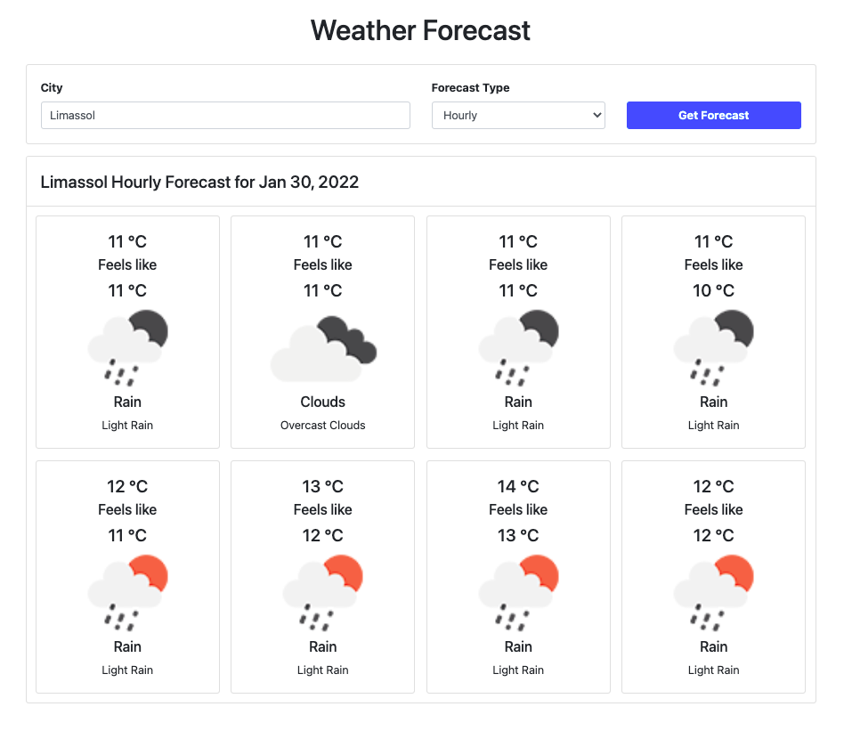

# JS Frameworks: WeatherApp

This project shows how is an app implemented in different frameworks.
Here is solution done in React, Angular and Vue using Typescript.

## Screenshot

## Features

- Utilize monorepo and managing repo using [NX](https://nx.dev)
- Coded in typescript to be safe
- Using [RxJS](https://rxjs.dev) over Promise cause offers extended features
-   
- 3 Apps that utilize their frameworks way of implementation
  - [React](apps/weather-react-app) - app developed using functional approach
  - [Angular](apps/weather-angular-app) - app developed using class approach
  - [Vue](apps/weather-vue-app) - app developed using optional approach
- 3 Libs that common to all apps and they are used by them
  - [Types](libs/weather-types) - all types used in applications
  - [Helpers](libs/weather-helpers) - all functions used for Pipes and Filters in applications
  - [Services](libs/weather-services) - all services and APIs used in applications
 -  libs/weather-helpers

### Apps Features
- Decoupled implementation leveraging components
- Search the weather forecast hourly or daily for a city
- Search box and two filter options, `hourly` and `daily` in header card
- Title and Tiles for displaying forecast in body card
- In the case of hourly mode, 8 tiles with 3-hour step are showing and in the case of daily mode 8 days.
- Displaying all states Loading, Data, No Found and Error
- Routing for displaying weather specifying city and forecast type
- URL is updated according to the search box and mode

### Libs Features
- [Services](libs/weather-services) features
  - Using the free [OpenWeather](https://openweathermap.org/api) API endpoints.
  - Get location coordinates for entered city `http://api.openweathermap.org/geo/1.0/direct?q={city name}&limit=1&appid={API key}`
    Find forecast for location depending on filter `https://api.openweathermap.org/data/2.5/onecall?lat={lat}&lon={lon}&exclude=current,minutely,daily,alerts&appid={API key}`

## Run

- [React](https://reactjs.org)
  - `nx serve weather-react-app`
- [Angular](https://angular.io)
  - `nx serve weather-angular-app`
- [Vue](https://vuejs.org)
  - `nx serve weather-vue-app`
